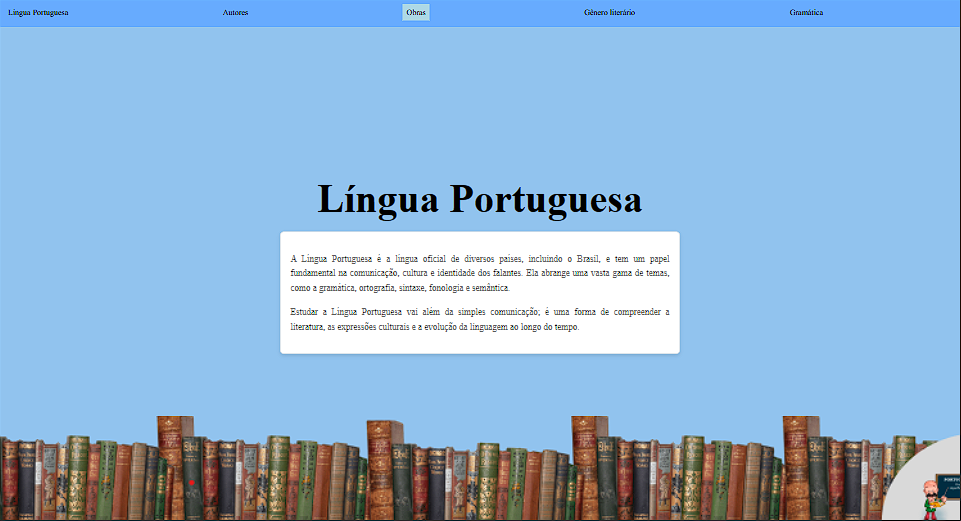
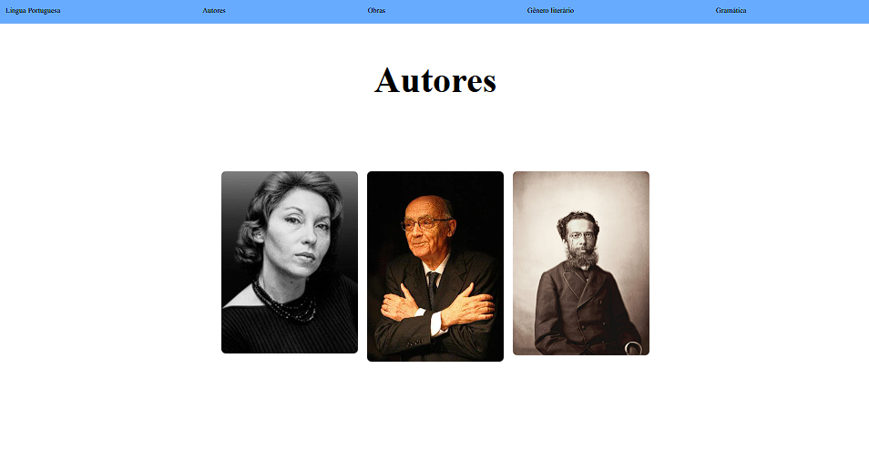
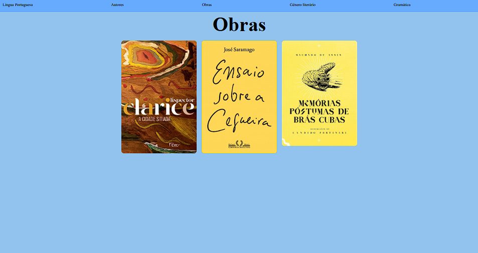
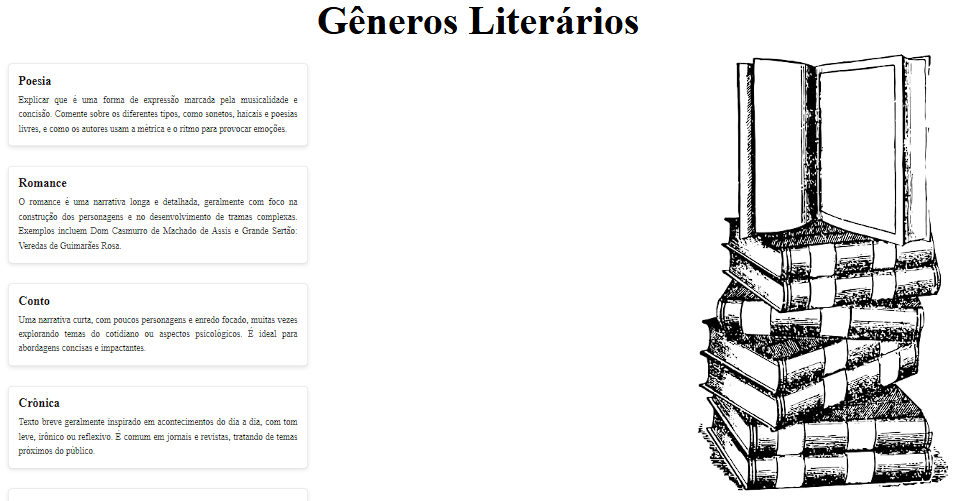
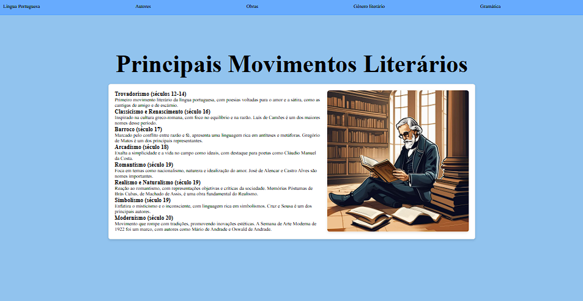
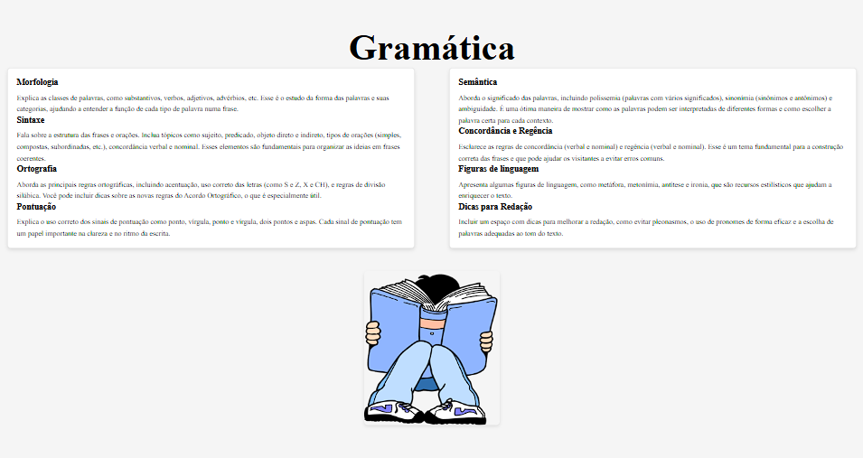

# LINGUA PORTUGUESA

---

# sobre
projeto final sobre lingua portuguesa. o intuito deste projeto e colocar em pratica o conhecimento adquirido sobre as linguagens de marcaçao, HTML, CSS e Markdwon, realizadas no curso tecnico de desenvolvimento de sistemas [SENAI Jandira](https://sp.senai.br/unidade/jandira/)

---

## Tecnologias Utilizadas
-HTML
-CSS
-Markdwon
-git

---

## Autores
-Gustavo Miguel
-Brian Martins
-Pedro Henrique